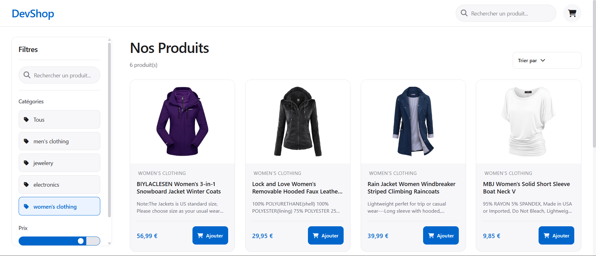
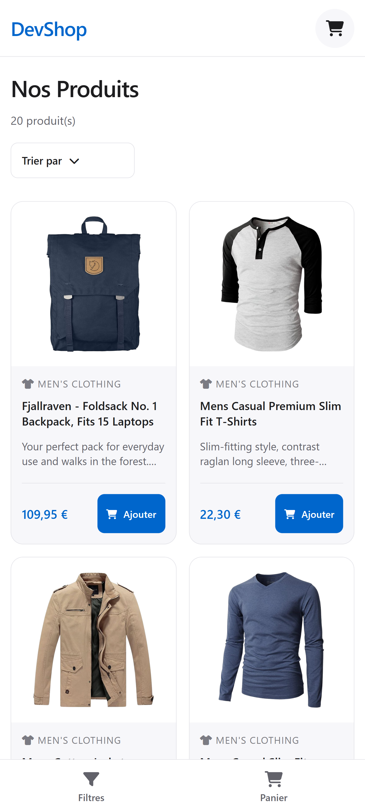

# DevShop

DevShop est une application e-commerce dynamique de type Single Page Application (SPA) réaliser en HTML, CSS et JavaScript. Elle permet de parcourir une sélection de produits depuis l'API FakeStore, de filtrer les résultats, de rechercher en temps réel et de gérer un panier d'achat interactif.



<p align="center">
  
</p>

## Démo

- GitHub Pages : https://flammeduciel.github.io/DevShop/
- Repository : https://github.com/Flammeduciel/DevShop

## Fonctionnalités

- Afficher une liste de produits récupérés depuis l'API FakeStore via `fetch()` et `async/await`
- Afficher dynamiquement les cartes produits (image, titre, prix, catégorie) générées en JavaScript
- Gérer les états de chargement avec un loader animé et les erreurs réseau
- Filtrer le catalogue par catégorie, prix maximum et terme de recherche
- Trier les résultats par prix croissant, décroissant ou par meilleure note
- Ajouter des produits au panier avec gestion des quantités
- Modifier les quantités ou supprimer un article dans le panier
- Persister le panier dans le `localStorage` pour conserver les articles après rafraîchissement
- Afficher un état vide illustré lorsqu'aucun produit ne correspond aux filtres
- Basculer entre les vues desktop et mobile avec une interface responsive adaptée
- Utiliser l'interface au clavier et avec une préférence de réduction des mouvements
- Naviguer via une barre inférieure compacte sur mobile avec icônes

## Expérience responsive

Sur ordinateur, les filtres restent accessibles dans une sidebar sticky pendant le défilement. Les produits s'affichent dans une grille responsive utilisant CSS Grid, avec des cartes contenant l'image, le titre, la catégorie, le prix et un bouton d'ajout au panier. Un menu déroulant permet de trier les produits.

Sur mobile, la sidebar laisse place à une navigation inférieure avec deux actions compactes (Filtres et Panier). Les filtres et la barre de recherche s'ouvrent dans un tiroir latéral afin de conserver la grille de produits lisible et de faciliter l'utilisation au pouce. Le tiroir du panier glisse depuis la droite pour afficher le résumé des articles.

## Lancer le projet

Ouvrir `index.html` dans un navigateur moderne ou démarrer un serveur local :

```bash
python -m http.server 8000
```

Puis visiter `http://localhost:8000`.

Les principales fonctions restent disponibles dans la console avec `window` :

```js
fetchProducts();          // Recharger les produits depuis l'API
resetFilters();           // Réinitialiser tous les filtres
openCart();               // Ouvrir le tiroir du panier
closeCart();              // Fermer le tiroir du panier
addToCart(1);             // Ajouter le produit ID 1 au panier
clearCart();              // Vider le panier
```

## Organisation du code

```text
DevShop/
|-- assets/
|   `-- css/
|       |-- variables.css    # Variables CSS, reset et utilitaires
|       |-- components.css   # Composants réutilisables (boutons, cartes, formulaires)
|       `-- layout.css       # Mise en page et responsive design
|-- index.html              # Structure HTML sémantique
|-- app.js                  # Logique JavaScript principale
`-- README.md               # Documentation
```

Les scripts sont chargés comme scripts classiques afin de conserver l'ouverture locale directe. `app.js` rassemble le rendu des produits, les filtres, la recherche, le tri, la gestion du panier et toutes les interactions. Les variables CSS sont isolées dans `variables.css`, les composants réutilisables dans `components.css`, tandis que la mise en page et le responsive design restent dans `layout.css`.

## Déploiement GitHub Pages

Le site peut être publié depuis la branche `main` et le dossier racine. Pour activer GitHub Pages :

1. Créer un dépôt GitHub
2. Pousser le code dans la branche `main`
3. Aller dans Settings > Pages
4. Sélectionner la branche `main` et le dossier `/` (root)
5. Sauvegarder

Le site sera accessible à l'URL `https://flammeduciel.github.io/DevShop/`

## Technologies

- HTML5 sémantique
- CSS avec Grid, Flexbox et propriétés personnalisées (variables CSS)
- JavaScript natif (ES6+) avec async/await
- FakeStore API pour la récupération des produits
- localStorage pour la persistance du panier
- Font Awesome 6.4.0 pour les icônes d'interface

## Cadre de realisation

Projet réalisé dans le cadre de l'apprentissage à Akieni Academy.
